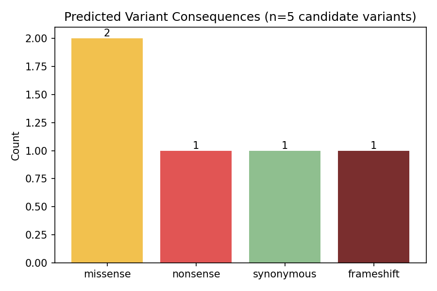

# Variant Impact Classifier

A small Python tool that predicts whether a DNA variant is **synonymous, missense, nonsense, or frameshift**, and flags the ones that are clinically significant (premature stop codons, frame shifts).

Built as a simplified version of tools like Ensembl VEP, using a real fragment of *TP53* — the most commonly mutated gene in cancer.

## Install

```bash
pip install -e .
```

## Run

```bash
variant-classify --fasta data/sample_tp53_fragment.fasta --variants data/sample_variants.csv --out results/
```

## Output

```
variant_id  pos ref alt predicted_consequence  clinically_flagged
        v1  522   C   T              missense               False
        v2  158   G   A              nonsense                True
        v3  302   A   G            synonymous               False
        v4  100   C                 frameshift                True
        v5  888   C   T              missense               False
```



## Tests

```bash
pytest -v
```

## License

MIT
